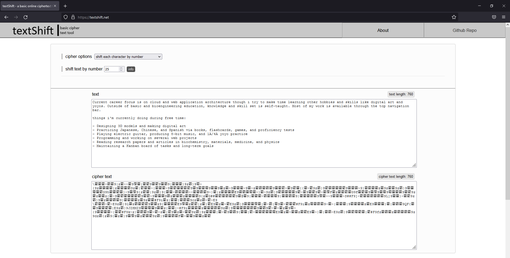

# [textshift.net](https://textshift.net/) | a basic online cipher tool



-------------

## usage
applet can be run in a web browser by checking out the repo and opening `index.html` in a web browser

## features
- various cipher options for encoding / decoding
  - cipher text functions such as shift, swap, insert, move, reverse, multiply, sequence
  - cipher text selection such as by partition, nth chars, index range, step sequence, character set, offset
- dynamic output when entering either text input or cipherText input
- responsive styling for mobile devices
- notes section which uses localStorage
- error handling for specific unicode characters

## cipher options
(1) shift each character by number | 
(2) reverse the text | 
(3) reverse text within each partition | 
(4) swap nth character with offset | 
(5) swap offset nth character with offset | 
(6) swap character pairs using step sequence | 
(7) move text subset to index | 
(8) sequence by partition | 
(9) sequence by every set of x characters | 
(10) insert text at index | 
(11) insert randomized text at index | 
(12) insert randomized text using step sequence | 
(13) insert variable-sized, randomized text using step sequence | 
(14) shift text subset | 
(15) shift multiple text subsets | 
(16) shift nth character by number | 
(17) shift offset nth character by number | 
(18) shift step sequence characters | 
(19) shift text subsets using step sequence | 
(20) shift characters by partition indices | 
(21) shift each character by multiple | 
(22) shift subset of text by multiple | 
(23) shift multiple subsets of text by multiple | 
(24) shift nth character by multiple | 
(25) shift offset nth character by multiple | 
(26) shift step sequence characters by multiple | 
(27) shift text subsets by multiple using step sequence | 
(28) shift characters by partition indices by multiple

## feature wishlist
- cipher types:
  - insert distributed text at indices
  - insert randomized text at indices
  - insert randomized, variable-sized text at indices
  - sequence by every set of x characters with step sequence skip
  - sequence by selected partition sets
  - move character subset to step sequence indices
  - for every set of characters of size x, shift the specified character indices in each set
  - for every set of characters of size x, multiply the specified character indices in each set
  - copy text subset to index
  - substitution swap 2 characters within text
- buttons to generate randomized inputs (e.g. index lists)
- documentation page to visualize encoding using example text

## tips
a complex cipher can be made by combining different ciphers together. this can be done by taking the
cipher text output and entering it as text input to another cipher and then repeating the same process with other
ciphers. to decode the cipher text, the cipher text is entered into the ciphers' cipher text field in the 
reverse order in which they were applied.

```

example: if i were to shift all the text characters by 5, 
and then take the cipher text output and encode it by shifting every 3rd character by 9, 
and then take the resulting output and and then encoding it by shifting every 5th character by 16, 
i can decode the cipher text by working backwards:

this is done by entering the cipher text into the cipher text field and 
decoding it using the third cipher (shift every 5th character by 16), 
and take the decoded text and decoding it using the second cipher (shift every 3rd character by 9), 
and take the decoded text and decoding it using the first cipher (shift all the text characters by 5).

```
