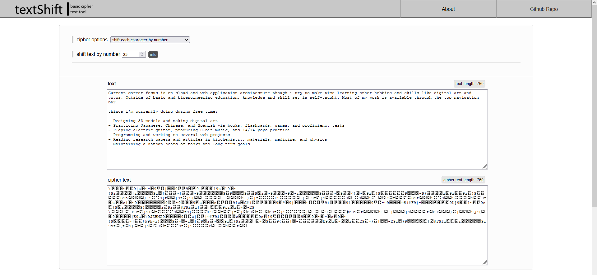

# [textShift.net](https://textshift.net/) | a basic online cipher tool

-------------

## usage
applet can be run in a web browser by checking out the repo and opening `index.html` in a web browser

## features
- cipher options for encrypting / decrypting
  - shifting each character's Unicode value by a set integer
  - shifting every nth character's Unicode value by a set integer
  - shifting by Unicode value by multiple
  - ability to select characters from an offset of each nth character
  - reverse cipher
- responsive output when entering either text input or cipherText input
- responsive styling for mobile devices

## tips
a complex cipher can be made by combining different ciphers together. this can be done by taking the
cipher text output and entering it as text input to another cipher and then repeating the same process with other
ciphers. to decode the cipher text, the cipher text is entered into the ciphers' cipher text field in the 
reverse order in which they were applied.

```

example: if i were to shift all the text characters by 5, 
and then take the cipher text output and encode it by shifting every 3rd character by 9, 
and then take the resulting output and and then encoding it by shifting every 5th character by 16, 
i can decode the cipher text by working backwards:

this is done by entering the cipher text into the cipher text field and 
decoding it using the third cipher (shift every 5th character by 16), 
and take the decoded text and decoding it using the second cipher (shift every 3rd character by 9), 
and take the decoded text and decoding it using the first cipher (shift all the text characters by 5).

```

## feature wishlist
- cipher types:
  - swap two char ranges
  - insert char range at index
  - nth partitions sequencer
  - combinational ciphers
    - swap at every nth char
    - character substitution swap
    - reverse chars within partitions
    - shift chars by list of indices

## textShift preview:

